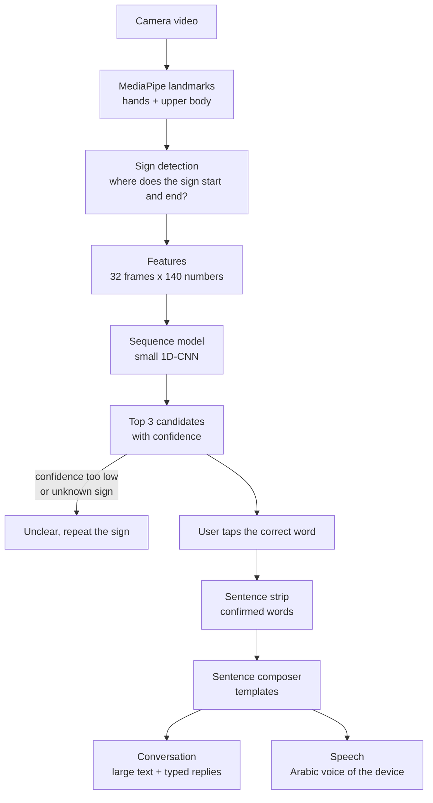
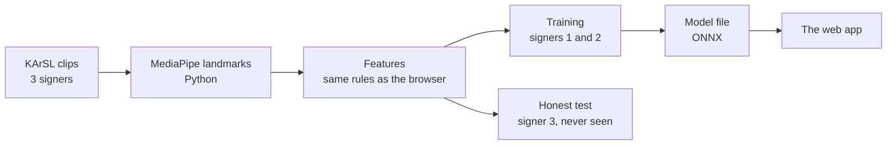

# Architecture

How a sign travels through Jisr, from the camera to a spoken Arabic sentence.
Everything in the diagram runs inside the phone's browser. Nothing is sent to the internet.

The same first steps are used to train the model, in Python:

## Words to know

- **Landmark:** a point that MediaPipe finds on the body, such as a fingertip or a shoulder.
- **Feature:** a number that describes the clip to the model (for example, where a fingertip is).
- **Sequence model:** a model that looks at many frames in order, not at a single picture.
- **Confidence:** how sure the model is about its answer, from 0% to 100%.
- **ONNX:** a file format for trained models that many programs, including browsers, can run.

## The components

### Camera video
The browser asks for the front camera. The picture is shown mirrored, like a mirror, so the signer
feels natural. File: `web/src/main.js`.

### MediaPipe landmarks
MediaPipe is a free Google library. Two of its models run on every camera frame: the Hand Landmarker
(21 points per hand) and the Pose Landmarker (we keep 9 points: nose, ears, shoulders, elbows, wrists).
No face-mesh model is used; the nose and ears come from the body-pose model and only serve as reference points. The model files are stored inside the app, so no internet is needed.
Files: `web/src/landmarks.js` (browser), `jisr/detect.py` (Python).

### Sign detection
The app does not guess all the time. A sign starts when a hand has been raised for a few frames,
and ends when the hands have been down for about 0.4 seconds. Only then is the clip classified.
Files: `web/src/segmenter.js`, settings in `config/segmenter.json`.

### Features
The landmarks of a clip are turned into a table of 32 frames x 146 numbers. Positions are measured
from the middle of the shoulders and divided by the shoulder width, so it does not matter where the
person stands or how far away they are. The exact rules are in `docs/features.md`, and they are
written twice: `jisr/features.py` (Python, for training) and `web/src/features.js` (browser).
A test checks that both give the same numbers.

### Sequence model
A small one-dimensional convolutional neural network (1D-CNN). It slides a small window along the
32 frames and learns short movement patterns. It has one output per word, plus one output called
"other sign" for gestures that are not in the vocabulary. Files: `jisr/model.py` (definition),
`scripts/train.py` (training), `models/jisr_model.onnx` (the trained model the browser runs),
`web/src/classifier.js` (running it with ONNX Runtime Web).

### Top 3 candidates and confirmation
The model's scores become probabilities. The app shows the 3 most likely words as large buttons,
and the user taps the correct one. If the best guess is below the rejection threshold, or the model
thinks the gesture is not one of our words, the app says "غير واضح، أعد الإشارة" instead of
guessing. File: `web/src/confidence.js`.

### Two parts of the site
The header has two tabs. **التعرّف** is the recognition part described here. **تعلّم الإشارات** is a learning
page that shows every word of the vocabulary with two short videos from the KArSL dataset (made by
`scripts/make_sign_videos.py` into `web/public/signs/`, with the dataset citation on the page). The camera loop
rests while the learning page is open. File: `web/src/learn.js`.

### Conversation
Recognition is shown as a conversation. When the signer presses "انطق وأرسل", the sentence is spoken and
becomes a message bubble; the hearing person types a reply in the box under the conversation, and it appears
as a bubble in large text for the signer to read. The history stays in the browser's local storage on the
device (never sent anywhere) and can be cleared. File: `web/src/chat.js`.

### Sentence strip
Confirmed words appear as chips. Each chip can be removed, and one button clears everything.
File: `web/src/main.js`.

### Sentence composer
Simple rules turn the words into a correct Arabic sentence, for example
"دواء" + "صداع" becomes "أحتاج إلى دواء للصداع". The rules are in `config/templates.json`, not in
code. If no rule fits, the words are simply joined. File: `web/src/composer.js`.

### Text and speech
The sentence is always shown in very large text. The "انطق" button speaks it with the device's own
Arabic voice (Web Speech API). If the device has no Arabic voice, the app says so and the other
person reads the large text. File: `web/src/speech.js`.

### Offline use
A service worker saves all the app's files on the device at the first visit. After that the app
opens and works without internet. Files: `web/public/sw.js`, `web/public/manifest.webmanifest`.
