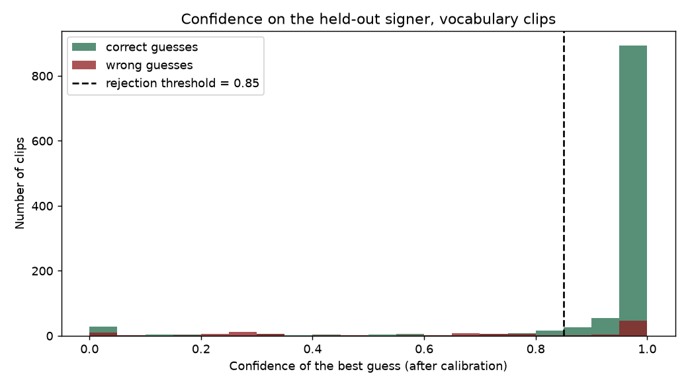
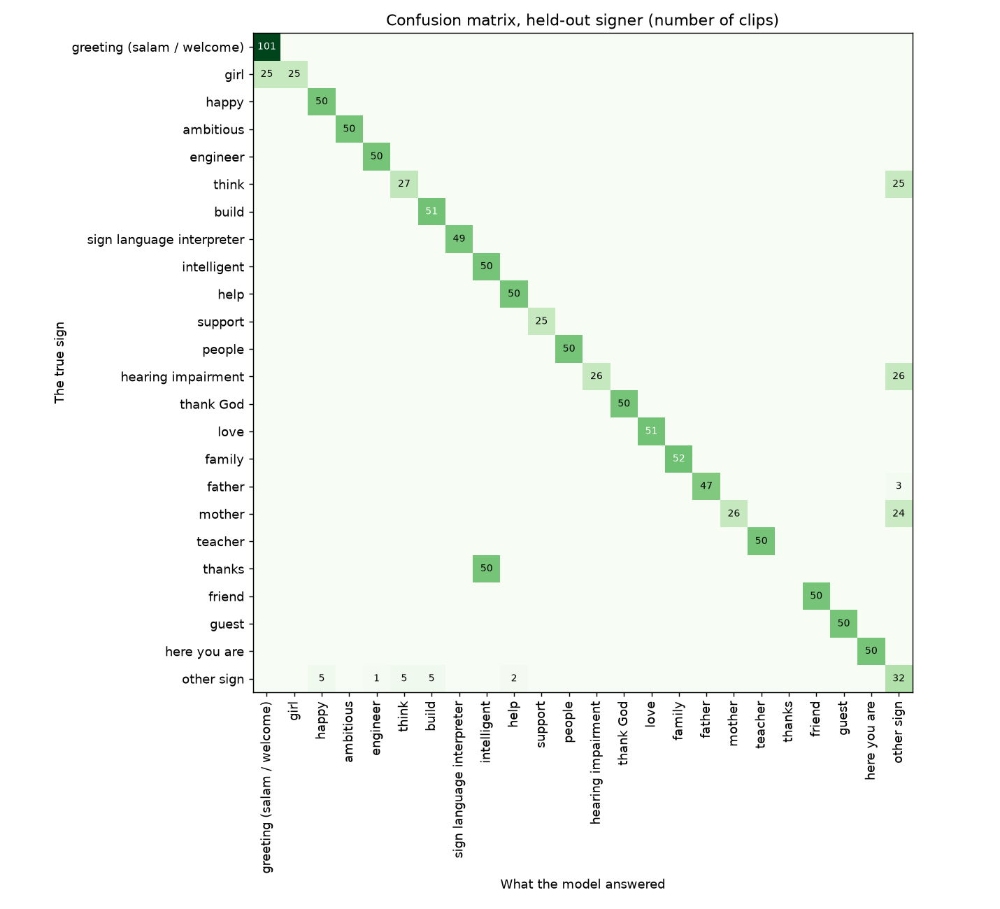

# Results report

Generated by `scripts/write_report.py` from the files in `reports/`. No number in this file was typed by hand.

## 1. Vocabulary

Scenario: **pharmacy**. All words come from the KArSL-502 dataset (see `docs/vocab_audit.md` for why the two primary datasets could not be used).

| id | Arabic | English | KArSL sign | Clips used (signers 1 / 2 / 3) |
|---|---|---|---|---|
| 0 | السلام عليكم | greeting | 290 | 50 / 51 / 51 |
| 1 | شكراً | thanks | 293 | 50 / 50 / 50 |
| 2 | صيدلية | pharmacy | 100 | 50 / 50 / 50 |
| 3 | مستشفى | hospital | 92 | 50 / 50 / 50 |
| 4 | طبيب | doctor | 497 | 50 / 51 / 50 |
| 5 | دواء | medicine | 132 | 50 / 52 / 51 |
| 6 | كبسولة | capsule | 135 | 50 / 51 / 51 |
| 7 | دواء شراب | liquid medicine | 136 | 50 / 51 / 51 |
| 8 | مرهم | ointment | 137 | 50 / 52 / 51 |
| 9 | قطارة | dropper | 138 | 50 / 51 / 51 |
| 10 | صداع | headache | 115 | 50 / 51 / 50 |
| 11 | ألم | pain | 116 | 50 / 50 / 50 |
| 12 | حمى | fever | 117 | 50 / 50 / 50 |
| 13 | زكام | cold | 113 | 50 / 50 / 50 |
| 14 | حساسية | allergy | 130 | 50 / 51 / 52 |
| 15 | مغص | colic | 120 | 50 / 50 / 50 |
| 16 | التهاب | inflammation | 111 | 50 / 50 / 50 |
| 17 | يأكل | eat | 160 | 50 / 51 / 51 |
| 18 | يشرب | drink | 161 | 50 / 51 / 51 |
| 19 | يساعد | help | 182 | 50 / 51 / 50 |

Plus one extra class, **"إشارة أخرى" (other sign)**, made from 40 KArSL signs outside the vocabulary for training, 10 different signs for validation and 10 different signs for the test (5 clips per sign and signer). It lets the app answer "unclear" for gestures it does not know.

## 2. Data after landmark extraction

Words: a *landmark* is a point MediaPipe finds on the body (fingertip, wrist, shoulder). A clip is *dropped* when MediaPipe never found a hand or a body in it.

- Clips processed: **3924**, kept: **3919**, dropped: **5**.
- Frames in which at least one hand was found: **95.8%**.
- Frames removed by the trim step (hand raise and lowering, step 3 of `docs/features.md`): **0.5%**. The training clips start with the hand already up, so the step removes almost nothing from them; in the app it removes the travel of the hand.

| Class | Clips | Kept | Dropped (no hand) | Hand found in frames |
|---|---|---|---|---|
| السلام عليكم | 152 | 152 | 0 | 89.1% |
| شكراً | 150 | 150 | 0 | 85.9% |
| صيدلية | 150 | 150 | 0 | 99.0% |
| مستشفى | 150 | 150 | 0 | 76.2% |
| طبيب | 151 | 151 | 0 | 99.0% |
| دواء | 153 | 153 | 0 | 99.6% |
| كبسولة | 152 | 152 | 0 | 86.4% |
| دواء شراب | 152 | 152 | 0 | 100.0% |
| مرهم | 153 | 153 | 0 | 100.0% |
| قطارة | 152 | 152 | 0 | 100.0% |
| صداع | 151 | 151 | 0 | 100.0% |
| ألم | 150 | 150 | 0 | 100.0% |
| حمى | 150 | 150 | 0 | 94.0% |
| زكام | 150 | 150 | 0 | 99.4% |
| حساسية | 153 | 153 | 0 | 100.0% |
| مغص | 150 | 150 | 0 | 96.1% |
| التهاب | 150 | 150 | 0 | 99.6% |
| يأكل | 152 | 152 | 0 | 99.9% |
| يشرب | 152 | 152 | 0 | 99.7% |
| يساعد | 151 | 151 | 0 | 89.3% |
| إشارة أخرى | 900 | 895 | 5 | 95.1% |

## 3. Evaluation protocol (how the numbers were measured)

KArSL has **3 signers**, and every clip says who signed it. We used this to measure accuracy on a person the model has never seen, which is the only honest way to estimate how the app behaves for a new user.

1. **Validation rounds** on the development signers [1, 2]: train on one, check on the other, and the other way round. All choices (model type, settings, number of epochs, the temperature and the rejection threshold) were made from these rounds only.
2. **Final model** trained on signers [1, 2] together, for 80 epochs, with data augmentation (mirroring, rotation, scaling, speed change, dropped frames, noise).
3. **One test** on signer 3, who was never used for any decision. The numbers below are from that single run.

Words: *overfitting* is when a model learns the training clips by heart and does badly on new ones; testing on a new signer shows whether that happened. *Top-1* is the share of clips whose best guess is right; *top-3* is the share whose correct word is among the three candidates the app shows.

## 4. Validation rounds (development signers)

| Train on | Check on | Clips checked | CNN top-1 | CNN top-3 | Baseline kNN-DTW top-1 |
|---|---|---|---|---|---|
| signer 2 | signer 1 | 1050 | 88.7% | 96.2% | 76.9% |
| signer 1 | signer 2 | 1064 | 91.9% | 99.6% | 65.2% |
| **mean** | | | **90.3%** | **97.9%** | **71.0%** |

Chosen model: **cnn** (88,437 parameters, 0.35 MB as ONNX). The baseline (nearest neighbour with dynamic time warping) only knows the vocabulary words.

## 5. Held-out signer test (the accuracy gate)

Signer 3, 1010 vocabulary clips, 50 unknown-sign clips.

| Measure | Result | Target | Met? |
|---|---|---|---|
| Top-1 accuracy | **93.6%** | 90.0% | yes |
| Top-3 accuracy | **99.6%** | 97.0% | yes |

### With the rejection threshold (what the app does)

Words: *calibration* (temperature scaling) corrects the model's confidence so that "80%" really means right about 8 times in 10. The *rejection threshold* is the confidence below which the app says "unclear, repeat the sign" instead of showing candidates.

- Temperature: **0.65**, threshold: **0.50** (both chosen on validation data (development signers only)).
- Vocabulary clips accepted (candidates shown): **88.2%**.
- Top-1 accuracy on the accepted clips: **99.4%**.
- Unknown signs correctly rejected: **90.0%**.
- Mean confidence when the best guess is right: **89.6%**; when it is wrong: **29.9%**.

### Per class

Words: *recall* is the share of real clips of a word that the model found; *precision* is the share of the model's answers for a word that were right.

The last two columns are what the user experiences: how often the app showed candidates (instead of "unclear"), and how often the correct word was among the 3 candidates **and** the app showed them.

| Class | Clips | Precision | Recall | Accepted by the app | Accepted and in top 3 |
|---|---|---|---|---|---|
| السلام عليكم | 51 | 100.0% | 100.0% | 100.0% | 100.0% |
| شكراً | 50 | 100.0% | 6.0% | 10.0% | 8.0% |
| صيدلية | 50 | 100.0% | 100.0% | 100.0% | 100.0% |
| مستشفى | 50 | 100.0% | 100.0% | 100.0% | 100.0% |
| طبيب | 50 | 100.0% | 100.0% | 100.0% | 100.0% |
| دواء | 51 | 100.0% | 64.7% | 58.8% | 58.8% |
| كبسولة | 51 | 0.0% | 0.0% | 0.0% | 0.0% |
| دواء شراب | 51 | 91.1% | 100.0% | 100.0% | 100.0% |
| مرهم | 51 | 100.0% | 100.0% | 100.0% | 100.0% |
| قطارة | 51 | 100.0% | 100.0% | 100.0% | 100.0% |
| صداع | 50 | 100.0% | 100.0% | 100.0% | 100.0% |
| ألم | 50 | 68.5% | 100.0% | 100.0% | 100.0% |
| حمى | 50 | 98.0% | 100.0% | 100.0% | 100.0% |
| زكام | 50 | 100.0% | 100.0% | 100.0% | 100.0% |
| حساسية | 52 | 100.0% | 100.0% | 100.0% | 100.0% |
| مغص | 50 | 98.0% | 100.0% | 100.0% | 100.0% |
| التهاب | 50 | 100.0% | 100.0% | 100.0% | 100.0% |
| يأكل | 51 | 100.0% | 100.0% | 100.0% | 100.0% |
| يشرب | 51 | 100.0% | 100.0% | 96.1% | 96.1% |
| يساعد | 50 | 100.0% | 100.0% | 100.0% | 100.0% |
| إشارة أخرى | 50 | 33.3% | 90.0% | n/a | n/a |

**Words that do not work for the held-out signer:** شكراً (accepted 10.0%), كبسولة (accepted 0.0%). The model answers "other sign" for most of this signer's clips of these words, so the app says "unclear" instead of offering them. The top-1 and top-3 numbers above only rank the words, so they do not show this; the acceptance rate does.

### Confusion matrix

Words: a *confusion matrix* is a table with the true sign in the rows and the model's answer in the columns; numbers off the diagonal are mistakes, and they show which signs get mixed up.

Full numbers: `reports/metrics.json`.

## 6. Browser tests

**Feature parity** (`reports/parity_report.json`): 42 held-out clips went through the Python feature code and the browser feature code, frame by frame, with the same pictures. Mean difference between the two feature tables: **0.00634** (features are measured in shoulder widths; limit 0.02), median per clip 0.00181; clips within the limit: **92.9%**; same model answer: **100.0%**. In 7 clips the two MediaPipe builds disagreed about whether a hand was visible in at least one frame; this is where the larger differences come from.

**End to end with a fake camera** (`reports/e2e_report.json`): 210 held-out clips were played to the real app as a camera stream, with a grey pause between clips. The app found the start and end of each sign, built the features and ran the model on its own.

- Browser top word agrees with Python: **86.2%** (target 95%: **not met**).
- Same answer shown to the user (same word, or both say "unclear"): **87.1%**.
- Same accept/unclear decision: **89.0%**.
- Among the 195 clips the app did detect: same top word **92.8%**, same decision **95.9%**.
- Clips the app did not detect at all: **15**; extra detections: **5**.
- Browser top word is the true word: **79.5%** (Python on the same video: 90.0%).
- The browser processed **12.2 frames per second** on the test laptop (MediaPipe on the GPU), while the video plays at 25; so the app saw about every second frame, unlike Python, which saw them all.

**Lighthouse** (`reports/lighthouse.report.json`): performance 99, accessibility 100, best-practices 100, seo 100. (Lighthouse removed its separate PWA category in 2024; offline use is checked by `web/e2e/offline.spec.js` instead.)
